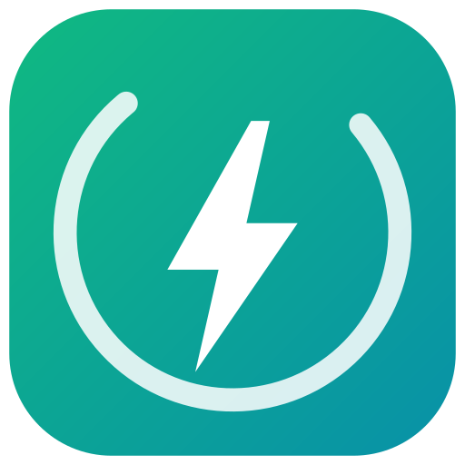

# EnerQ

A multi-agent AI energy system for commercial facilities. Four specialist agents — coordinated, not one monolithic script — observe consumption, investigate waste, simulate candidate interventions against a facility Digital Twin, decide, and follow up until the result is verified. EnerQ doesn't stop at a dashboard alert; it acts.

## The agents

Each agent owns 2-3 of the pipeline's nine stages and lives in its own file under `src/agent/agents/` — a coordinator (`src/agent/orchestrator.ts`) holds the shared facility state and calls each agent in turn, but none of the actual domain reasoning lives there.

| Agent | Stages | Responsibility | File |
|---|---|---|---|
| **ObserverAgent** | Observe, Detect | Ingests telemetry, flags anomalies against baseline | [`observerAgent.ts`](src/agent/agents/observerAgent.ts) |
| **DiagnosticAgent** | Investigate, Generate Solutions | Isolates root cause, drafts candidate interventions | [`diagnosticAgent.ts`](src/agent/agents/diagnosticAgent.ts) |
| **SimulationAgent** | Simulate, Compare, Decide | Runs the Digital Twin, scores candidates, picks a winner | [`simulationAgent.ts`](src/agent/agents/simulationAgent.ts) |
| **ActionAgent** | Recommend, Verify | Hands off for approval (or executes autonomously), then confirms the result | [`actionAgent.ts`](src/agent/agents/actionAgent.ts) |

The split isn't cosmetic: each agent is independently replaceable. ObserverAgent, for instance, is the one piece you'd swap to point at a real BMS/IoT feed instead of mock telemetry — nothing else in the system needs to change.

## How the pipeline runs

| Stage | Agent | What happens |
|---|---|---|
| Observe | Observer | Ingests facility telemetry, baseline averages, and operating schedules |
| Detect | Observer | Computes consumption variance against baseline and flags anomalies past threshold |
| Investigate | Diagnostic | Decomposes sub-meter profiles (HVAC, lighting, plug loads, solar) to isolate root cause, grounded in a RAG knowledge base |
| Generate Solutions | Diagnostic | Synthesizes candidate interventions with their projected savings and risk profile |
| Simulate | Simulation | Runs each candidate through the Digital Twin's physics model |
| Compare | Simulation | Scores every candidate with a weighted multi-criteria formula — savings, operational risk, occupant comfort |
| Decide | Simulation | Selects the highest-scoring candidate; the selection is computed, not hardcoded |
| Recommend | Action | Presents the decision with cost/ROI, either awaiting approval or executing autonomously depending on authorization level |
| Verify | Action | Confirms the actual result against the initial claim after implementation |

If a recommendation is left unapproved, ActionAgent reminds and then escalates rather than letting it sit — the same follow-through loop applies whether a human approves each action or the agent is authorized to act on its own.

## Architecture

- **Coordinator** (`src/agent/orchestrator.ts`): owns the shared facility state, the pub/sub that keeps the UI in sync, and pipeline timing. Delegates every stage's actual logic to one of the four agents above.
- **Decision engine** (`src/simulation/engine.ts`): deterministic multi-criteria scoring (60% savings, 30% risk, 10% comfort) over each candidate solution. Auditable and reproducible — the same inputs always produce the same decision, and the ranking changes if the inputs do. Accepts an optional customization override (HVAC cutoff time, thermostat setpoint offset) so a candidate solution can be tuned to a specific building instead of the demo defaults.
- **Reasoning layer**: a local LLM (Ollama, `qwen2.5:3b-instruct` by default — chosen for its Arabic quality at a footprint safe for an 8GB-RAM, no-GPU laptop) generates the investigation, recommendation, and chat-assistant narrative, grounded by retrieval against a small, bilingual energy-management knowledge base (`src/knowledge/`). Every generated explanation cites the source it drew from. No API key or external network call is required — reasoning runs entirely on-device via `src/agent/agents/reasoningClient.ts` calling the server's `/api/agent/reason` endpoint.
- **Deterministic fallback**: if the LLM is unavailable, the same pipeline — and the chat assistant — runs on templated reasoning with identical citations and UI, including keyword-matched answers to zone- and equipment-specific questions. The agents' decisions and outputs are never dependent on the LLM being reachable.
- **Digital Twin**: a facility physics model (HVAC, lighting, plug loads, solar, 3 zones) used to simulate each candidate intervention before it's recommended, with live customizable parameters per scenario.

## Stack

React 19 · TypeScript · Express · Vite · Tailwind CSS · Ollama (OpenAI-compatible API)

## Setup

```bash
npm install
npm run dev   # http://localhost:3000
```

Runs fully out of the box on the deterministic reasoning engine — no configuration required.

For live LLM-generated reasoning:

```bash
ollama pull qwen2.5:3b-instruct
cp .env.example .env   # defaults already point at a local Ollama instance
npm run dev
```

`ollama pull` and `ollama serve` come from the [Ollama desktop app](https://ollama.com) (or its CLI) — nothing in this repo starts Ollama itself; the app just checks `/api/tags` on `127.0.0.1:11434` and uses whatever's already running there. `src/agent/agents/reasoningClient.ts` is the only file that talks to it, via `server.ts`'s `/api/agent/reason` endpoint.

## License

MIT — see [LICENSE](LICENSE).
